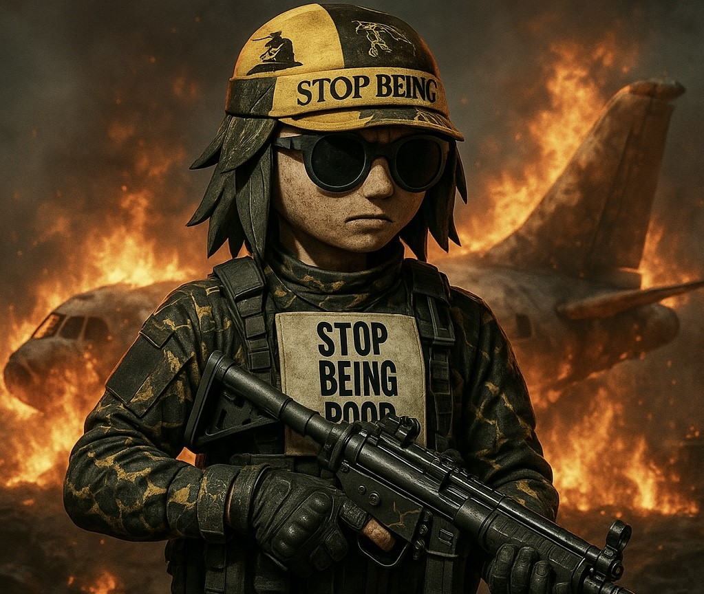

<!DOCTYPE html>
<html lang="en">
<head>
  <meta charset="UTF-8" />
  <meta name="viewport" content="width=device-width, initial-scale=1.0"/>
  <title>TRENCH WARFARE</title>
  
</head>
<body>

  <header>
    
TRENCH WARFARE

  </header>

  

    
  

  

    

      Welcome to the call of duty — TRENCH WARFARE. No man or woman is left behind enemy lines. 
      We feel at home in the trenches, in the dark and cold. We weren’t raised in the trenches — we were born in it.
    

  

  

    <h2>MISSION BRIEFING</h2>
    <ul>
      <li>Launch meme coin stealth style, no presale, no mercy. 🔫</li>
      <li>Secure liquidity on a DEX, make it untouchable. 🔫</li>
      <li>Ignite the trenches with meme warfare across socials. 🔫</li>
      <li>Drop exclusive airdrops for the OG soldiers. 🔫</li>
      <li>Unleash trench NFTs and battle-ready merch. 🔫</li>
      <li>Begin phase 2 — partnerships, raids, and domination. 🔫</li>
    </ul>
  

  

    <button>PUMP FUN</button>
    <button>X</button>
    <button>DEX</button>
  

</body>
</html>
